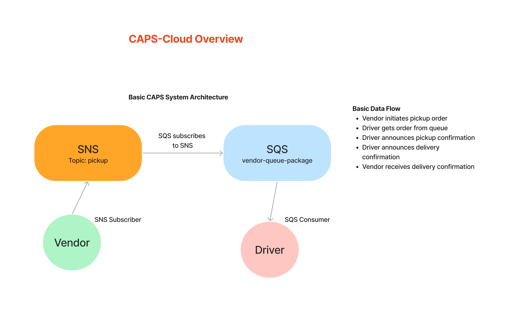

# Caps Cloud -- Code Challenge 19

## Author: Alan Chelko

    * Collaboration: in-class demos, Felix Yu (via youtube: <https://www.youtube.com/watch?v=SPyDoTkRolY>), Robert Ball

## Problem Domain

Using only AWS Services: SQS, SNS, Lambda, create a cloud version of the CAPS system.

## Feature Tasks & Requirements

* Required Services
  * SNS Topic: pickup which will receive all pickup requests from vendors
  * SQS Queue (FIFO): packages which will contain all delivery requests from vendors, in order of receipt.
    * Subscribe this queue to the pickup topic so all pickups are ordered
  * SQS Queue (Standard) for each vendor (named for the vendor) which will contain all delivery notifications from the drivers

## Documentation

### AWS Usage

* Set up standard SNS topic ('pickup') on AWS
* Set up standard SQS queue ('vendor-packages-queue') on AWS
* Unrelated to final lab, but set up Lamba ('sns-receiver') to test SNS during class demo code-along

### OVERVIEW

